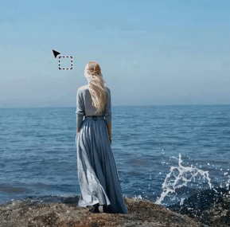
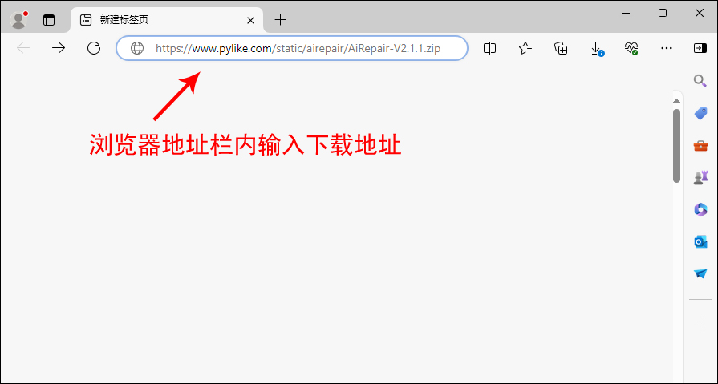
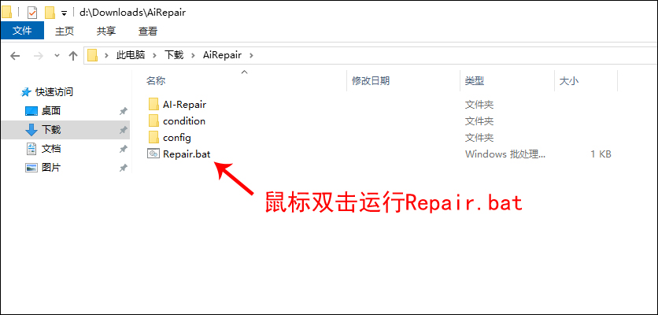
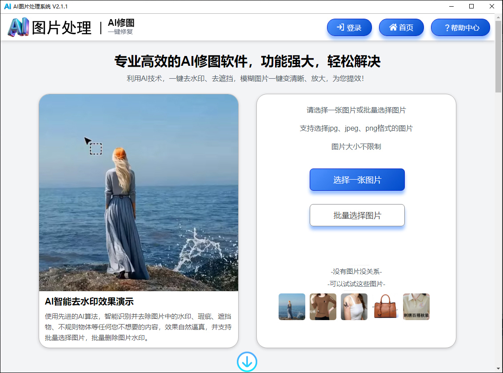

# claude code意外把包含源码的文件上传到npm仓库,版本号是2.1.88导致源码泄露,如今有一款AI去水印工具居然可以免费使用没有任何限制,模糊图片可以变清晰或无损放大

这款免费的AI去水印工具，通过Python编程的Django框架开发设计，融合了LaMa等前沿AI模型，为用户提供了 ‍“智能擦除”‍、‍“一键批量去除水印”‍ 和 ‍“将模糊老照片还原至高清状态或者无损放大”‍ 等功能。支持完全本地化电脑操作，所有图像处理都在本地电脑上完成，无需将图片上传到云端，有效保护用户隐私安全，无需安装、开箱即用。

### 如何下载

普通Windows用户可以一键下载原版项目文件，下载后双击运行即可启动，无需安装、无需联网、开箱即用、安全无毒。

### 下载地址

**项目下载地址（Windows电脑版本）：** https://www.pylike.com/static/airepair/AiRepair-V2.1.1.zip

**注意：** 用任意浏览器访问上面的网址，即可下载。

**详细介绍下载方法：** 直接点击https://www.pylike.com/static/airepair/AiRepair-V2.1.1.zip后，浏览器会直接开始下载。这里需要注意的是，有的浏览器会弹出一个下载框，询问你是否保存该文件，点击“保存”按钮后会自动将文件保存在浏览器默认的“下载”文件夹中，如下图所示。

### 打开工具

如上图所示，下载后得到一个**AiRepair-V2.1.1.zip**压缩包。解压压缩包后出现一个名为“AiRepair”的文件夹，所有的项目文件都在里面，且该“AiRepair”文件夹可以被复制存放到电脑的任意位置。不需要任何安装和配置，也不要随意修改“AiRepair”文件夹内的组件。点击进入“AiRepair”文件夹后，里面有个Repair.bat启动文件，鼠标双击运行Repair.bat就可以打开AI图像修复工具，如下图所示。

