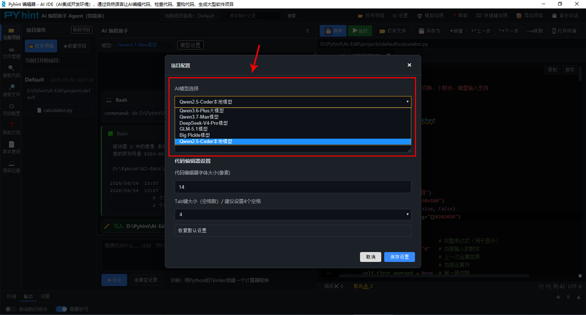

# AI一句话生成代码/修改代码国产高性价比AI编程助手Pyhint智能体告别高昂的ClaudeCode

Claude Code火了快两年了，从最开始的小范围试用，到现在成为不少开发者做项目、改代码的标配工具，大家对它的感受出奇一致：功能强大，但是用起来真肉疼。**Claude Code**是Anthropic推出的终端 AI 编程助手，通过AI模型可一键生成完整项目、批量写代码、重构工程、自动处理依赖与打包脚本，是目前很多软件开发者必备的工具。但国内开发者使用原版Claude Code面临着两大痛点：一是官方 API 资费高昂，Claude 3.5 Sonnet 输入约 21 元 / 百万 Token、输出超 100 元 / 百万 Token，高频开发成本难以承受；二是国内无法直连，必须借助特殊网络环境，稳定性差、访问频繁超时。

那么，有没有办法使用国内更高性价比的大模型 API，搭建一个类似 Claude Code 的 AI 编程助手？答案是：有，而且现在已经比较成熟。在此背景下，**Pyhint AI 编程助手**应运而生，它是一款基于AI大模型的国产高性价比智能体，国内直连、无IP限制、成本仅Claude Code的1/8~1/15，无论是生成代码、代码补全、修改代码、解释报错、重构项目，还是生成大型软件项目，**Pyhint编程助手**都能显著提升效率，完全可以替代Claude Code，尤其是在大规模调用AI模型、长上下文分析、批量生成代码时，成本优势比较明显。

###一、Pyhint是什么

**Pyhint**是基于Python语言开发的 AI 编程智能体（Coding Agent），提供了一个无需安装、无需联网、开箱即用的Python集成开发环境（Python IDE）。国内用户可一键下载原版纯净软件包，安全无毒，支持Windows 8.1~Windows 11电脑操作系统。原生适配Qwen3.6-Plus、Qwen3.7‑Max、DeepSeek-V4-Pro、GLM‑5.1、Big Pickle大模型API对接，一键切换模型是它最核心的竞争力，完美适配国内高性价比API。**Pyhint**把编程所需的功能（AI代码生成、编辑、修改、调试、构建、运行等）整合进一个界面里，开发者只需一句话就能设计出自己想要的软件项目。

####Pyhint主要优势

之所以Pyhint能替代Claude Code，它的主要优势如下：

界面简洁：Pyhint程序GUI界面采用经典三栏式布局，延续开发者熟悉的 IDE（集成开发环境） 设计逻辑，深色主题为默认风格，减轻长时间编码的视觉疲劳，整体简洁高效、无冗余元素。

通过直观的操作界面和 AI 对话：打破传统的命令行终端操作壁垒，以可视化布局、实时交互与多场景适配，降低 AI 编程工具的使用门槛，适配从新手到资深开发者的全层级用户需求。

一键从零生成全项目：操作界面输入自然语言需求，自动新建项目目录、生成源码、requirements.txt、配置文件，从空白文件夹落地完整工程（如 Django 网站、PyQt 桌面程序、图像处理工具、视频处理工具）。

旧项目重构优化：让 AI 阅读整个项目，读取现有源码，按需求重构架构、优化性能、补齐注释、拆分模块；

全自动 BUG 排查修复：定位项目报错、自动补全缺失依赖、修复语法漏洞，批量修正全项目同类问题；

全能工具箱：Pyhint程序把写代码、运行代码、调试错误、查看文件、管理项目全部整合在一个软件里。不用开好几个窗口，一个软件搞定所有开发工作，是程序员必备工具！

###二、Pyhint中的AI模型介绍

如上图所示，Pyhint中可使用**在线AI模型**和**本地模型Qwen2.5-Coder**。*本地模型Qwen2.5-Coder**是通义千问（Qwen）系列中的轻量级代码专用模型，是在本地电脑可离线运行的轻量模型，无需网络连接，无需 API Key，推理速度慢，适合简单任务和代码生成，只能输出基础代码，无法进行复杂的项目创建、检查、修改、重构代码等操作。如需完整功能，可切换到其他在线AI模型。

**Pyhint中的在线AI模型包括：**Qwen3.6-Plus大模型、Qwen3.7‑Max模型、DeepSeek-V4-Pro模型、GLM‑5.1模型、Big Pickle模型。

**Qwen3.6-Plus**是通义千问发布的国产大语言模型‌，被誉为"中国编程能力最强的模型"，属于顶级多模态模型，支持文本/图像/视频推理，擅长全项目代码重构，支持复杂的代码生成/检查/修改/重构。新用户可享有免费的试用额度，免费额度用完后将按Token‌量计费。

**Qwen3.7‑Max**是通义千问最新纯文本模型，主打长程智能体（Agent），综合性能国产第一，接近 GPT‑5.5、Claude Opus 4.7。Qwen3.7‑Max 综合能力显著强于 Qwen3.6‑Plus。新用户可享有免费的试用额度，免费额度用完后将按Token‌量计费。

**DeepSeek-V4-Pro**是DeepSeek团队发布的新一代大语言模型，被广泛认为是当前‌最强的开源大模型之一，新用户可享有免费的试用额度，免费额度用完后将按Token‌量计费。

**GLM‑5.1**是智谱 AI 发布的最新旗舰大模型，具备强大的逻辑推理、代码生成与长文本理解能力，新用户可享有免费的试用额度，免费额度用完后将按Token‌量计费。

**Big Pickle**是 OpenCode 推出的一款限时免费大语言模型，每天都会有免费限时额度，超过限时额度需等次日再使用。注意：使用限时免费 Big Pickle 模型账号，风控严格，严禁在同一台电脑上或同一局域网内切换使用多个不同的 Big Pickle 模型账号 API Key，且每分钟/每小时有严格限制请求上限，如果过于频繁调用模型会抛出错误码“429”。

###三、总结

**Pyhint AI编程助手**GUI界面并非简单的 “命令行可视化”，而是围绕开发者核心需求设计的高效、安全、易用的 AI 编程交互体系。通过三栏式清晰布局、实时代码对比、多模型切换、会话管理等核心设计，既保留了“直观简易操作、隐私可控、多模型兼容” 的核心优势，又解决了命令行操作门槛高、效率低的痛点，让 AI 编程从 “专业工具” 变为 “全民可用的开发助手”。

随着 AI 编程工具的普及，Pyhint的设计逻辑 ——“能力不缩水、界面轻量化、交互自然化”，或将成为同类工具的标杆，推动 AI 辅助开发走向更高效、更普及的新阶段。

###四、‌运行代码

使用AI模型生成项目代码后，在左边的文件树中点击指定代码文件，就可以在右边的编辑区域内打开该文件，再点击上面的“运行”按钮，就可以运行项目的Python代码。如下图所示：

在右边的编辑区域还可以对代码进行二次编辑开发。Pyhint属于集成开发环境，带有一整套工具，可以帮助编程人员在使用Python语言开发软件项目时提高效率，比如代码生成、代码编辑、运行调试、语法高亮、智能提示、实时代码错误提示等。

###五、Pyhint下载

**Pyhint**提供了一个无需安装、无需联网、开箱即用的AI编程助手。一键下载原版项目文件，安全无毒，支持‌在Windows 8.1~Windows 11电脑操作系统上运行，兼容CPU和GPU两大核心处理器，在CPU设备上也能完成流畅的编程任务，而在GPU设备上则能获得更快的推理速度。

####Pyhint下载方法

**Pyhint下载地址：** [https://www.pylike.com/static/pyhint/Pyhint-V2.1.7.zip](https://www.pylike.com/static/pyhint/Pyhint-V2.1.7.zip "https://www.pylike.com/static/pyhint/Pyhint-V2.1.7.zip")

**注意：** 用任意浏览器访问上面的网址，即可下载。

**下载详解：** 直接在浏览器地址栏内输入[https://www.pylike.com/static/pyhint/Pyhint-V2.1.7.zip](https://www.pylike.com/static/pyhint/Pyhint-V2.1.7.zip "https://www.pylike.com/static/pyhint/Pyhint-V2.1.7.zip")，点击键盘的Enter回车键后，浏览器会直接开始下载。这里需要注意的是，有的浏览器会弹出一个下载框，询问你是否保存该文件，点击“保存”按钮后会自动将文件保存到浏览器默认的“下载”文件夹中，如下图所示。

如上图所示，下载后得到Pyhint-V2.1.7.zip压缩包。解压压缩包后出现一个名为“Pyhint”的文件夹，所有的项目文件都在里面，且该“Pyhint”文件夹可以被复制存放到电脑的任意目录内，这里需要注意的是，不能存放在中文目录内，比如不能存放在“D:\软件\Pyhint”内，但是可以存放在“D:\software\Pyhint”或者“D:\Pyhint”内。不需要任何安装和配置，也不要随意修改“Pyhint”文件夹内的组件。点击进入“Pyhint”文件夹后，里面有个Pyhint.bat启动文件，鼠标左键双击运行Pyhint.bat就可以打开Pyhint AI编程助手，如下图所示。

###六、Pyhint使用说明

Pyhint的详细使用说明请查看https://www.pyhint.com/article/172.html。

