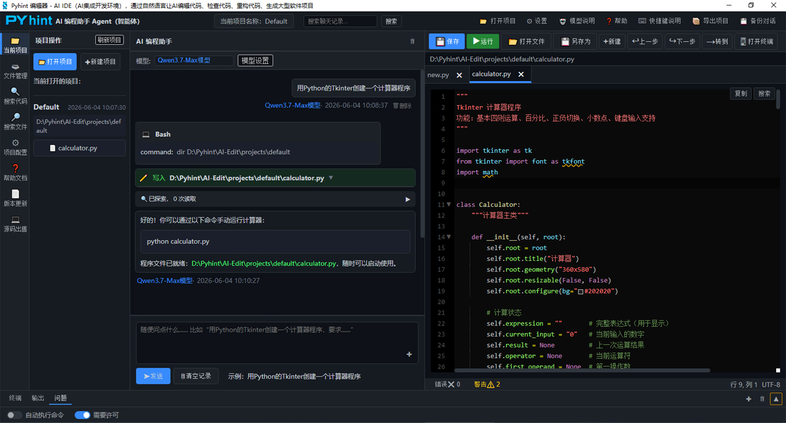
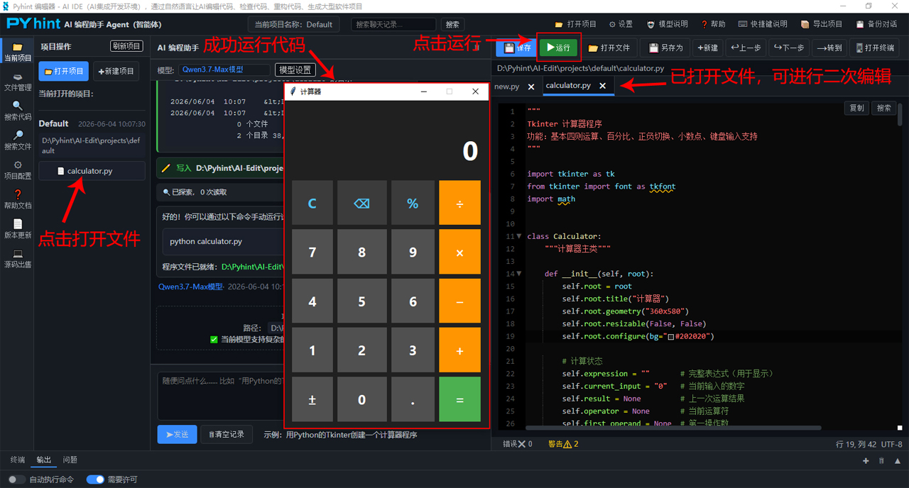
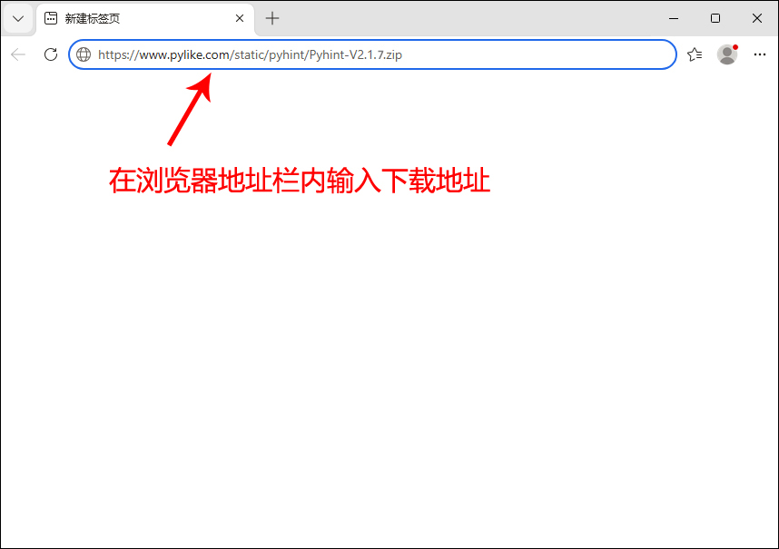
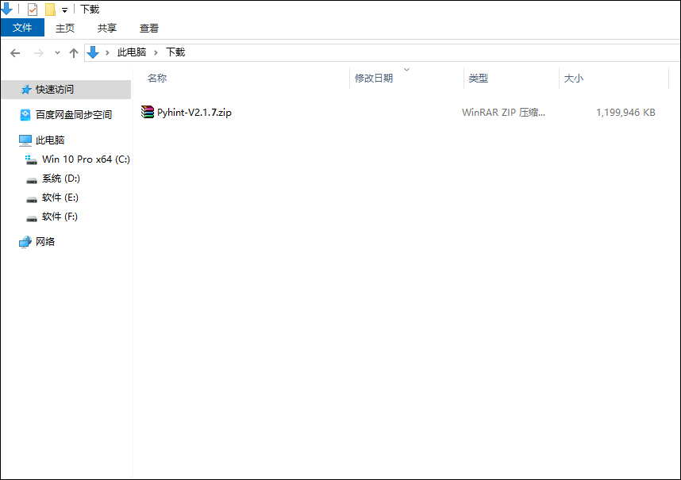
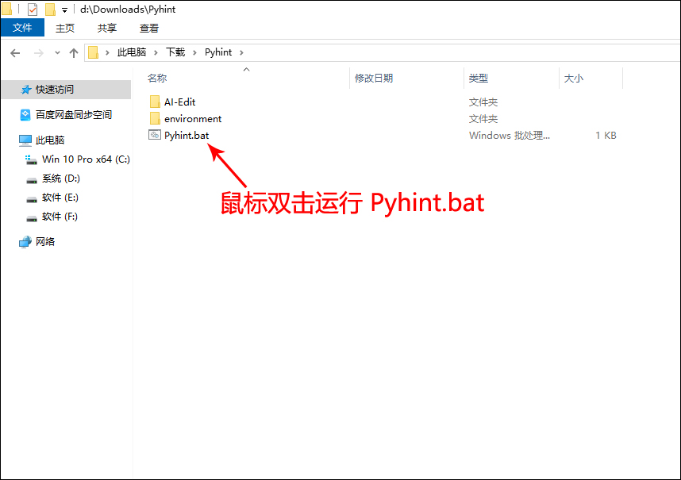

# AI一句话生成软件Pyhint智能体,国产AI编程助手一键检查/修改代码,替代高价的ClaudeCode

你还在为高昂的Claude Code成本烦恼？为什么不试试用国内高性价比 API 搭建你的 AI 编程助手？

近两年，AI 编程工具已经从“尝鲜玩具”变成了很多开发者日常工作流的一部分。无论是代码补全、解释报错、重构项目，还是生成测试用例、阅读陌生代码库，Claude Code这类工具都能显著提升效率。

但问题也很明显：成本并不低。如果你是个人开发者、小团队，或者需要在公司内部大规模使用，长期调用海外大模型 API，费用、网络稳定性、数据合规等问题都会逐渐凸显。

Claude Code是 AI 厂商Anthropic官方出品、基于Claude 4大模型的终端原生Agent智能编程工具（2025 年 3 月发布，2026 年正式量产 GA），区别于普通代码补全插件，是能直接操控本机电脑文件、运行系统指令的自主 AI 编程工程师。Claude Code不是网页聊天软件、不是 IDE 小插件：拥有本机完整文件读写、终端命令执行、Git操作、联网权限，自然语言下达需求，AI 自主完成全链路开发，从需求 → 编码 → 调试 → 测试 → 提交代码全自动化执行。作为一个日常依赖AI写代码的开发者来说，使用Claude Code每个月API调用费用不但价格昂贵，而且国内开发者还要额外解决网络问题，时不时登录失败、响应超时，折腾半天才能连上，心态都快崩溃了。

那么，有没有办法使用国内更高性价比的大模型 API，搭建一个类似 Claude Code 的 AI 编程助手？答案是：有，而且现在已经比较成熟。在AI赋能编程快速普及的当下，**Pyhint**凭借轻量高效、跨平台、AI深度集成的特性，成为开发者日常编码、项目迭代、智能调试的热门工具。不同于传统纯命令行编码工具，**Pyhint**搭载了成熟完善的图形操作界面（GUI），兼顾新手的可视化操作需求与资深开发者的高效办公习惯。其图形界面摒弃了冗余繁杂的设计，以简洁模块化布局、直观的功能分区、多端统一的交互逻辑，构建了轻量化AI编码交互体系，成为区别于传统代码编辑器与AI编码工具的核心优势之一。

### 一、Pyhint是什么

**Pyhint**是基于Python语言开发的 AI 编程智能体（Coding Agent），提供了一个无需安装、无需联网、开箱即用的Python集成开发环境（Python IDE）。国内用户可一键下载原版纯净软件包，安全无毒，支持Windows 8.1~Windows 11电脑操作系统。**Pyhint**拥有直观的图形操作界面，原生适配Qwen3.6-Plus、Qwen3.7‑Max、DeepSeek-V4-Pro、GLM‑5.1、Big Pickle大模型API对接，支持灵活切换多种模型，完美适配国内高性价比API。**Pyhint**把编程所需的功能（AI代码生成、编辑、修改、调试、构建、运行等）整合进一个界面里，只要你会说中文，只要你能把需求讲清楚，哪怕一行代码都看不懂，也能一句话做出自己想要的软件。

#### Pyhint 的主要优势

**Pyhint能成为Claude Code理想替代方案的主要原因如下：**

**简洁易用的界面：** 其图形用户界面（GUI）采用经典的“三栏式”布局，沿袭了主流 IDE（集成开发环境）的设计逻辑。默认采用深色主题以减轻长时间编码带来的视觉疲劳，从而提供一种精简、高效且清爽的使用体验。

**AI 聊天与直观交互：** 它打破了传统命令行界面的局限性。通过可视化布局、实时交互以及对多种应用场景的适应能力，它降低了 AI 辅助编程工具的使用门槛，既适合初学者，也能满足资深工程师的需求。

**一键从零创建项目：** 只需用自然语言输入需求，即可将一个空文件夹转化为功能完备的项目（例如 Django 网站、PyQt 桌面应用或图像/视频处理工具）。该工具会自动生成项目目录、源代码、requirements.txt文件及各类配置文件。

**重构与优化旧项目：** AI 会分析整个项目及现有源代码，从而根据您的具体要求优化代码、补充缺失注释、重构架构并实现代码模块化。

**全自动识别并修复 Bug：** 它能自动识别错误、安装缺失的依赖项、修正语法错误，并针对项目中的同类问题进行批量修复。

**全能工具箱：** Pyhint是一款集文件操作、项目管理、调试、编码和程序运行于一体的综合性工具。它让您无需在多个窗口间频繁切换，即可在一个界面内管理整个开发工作流程，是程序员不可或缺的利器。

### 二、‌运行代码

使用AI模型生成项目代码后，在左边的文件树中点击指定代码文件，就可以在右边的编辑区域内打开该文件，再点击上面的“运行”按钮，就可以运行项目的Python代码。如下图所示：

在右边的编辑区域还可以对代码进行二次编辑开发。Pyhint属于集成开发环境，带有一整套工具，可以帮助编程人员在使用Python语言开发软件项目时提高效率，比如代码生成、代码编辑、运行调试、语法高亮、智能提示、实时代码错误提示等。

### 三、Pyhint下载

**Pyhint**提供了一个无需安装、无需联网、开箱即用的AI编程助手。一键下载原版项目文件，安全无毒，支持‌在Windows 8.1~Windows 11电脑操作系统上运行，兼容CPU和GPU两大核心处理器，在CPU设备上也能完成流畅的编程任务，而在GPU设备上则能获得更快的推理速度。

**Pyhint下载地址：** [https://www.pylike.com/static/pyhint/Pyhint-V2.1.7.zip](https://www.pylike.com/static/pyhint/Pyhint-V2.1.7.zip)

**注意：** 用任意浏览器访问上面的网址，即可下载。

**下载详解：** 直接在浏览器地址栏内输入[https://www.pylike.com/static/pyhint/Pyhint-V2.1.7.zip](https://www.pylike.com/static/pyhint/Pyhint-V2.1.7.zip)，点击键盘的Enter回车键后，浏览器会直接开始下载。这里需要注意的是，有的浏览器会弹出一个下载框，询问你是否保存该文件，点击“保存”按钮后会自动将文件保存到浏览器默认的“下载”文件夹中，如下图所示。

如上图所示，下载后得到Pyhint-V2.1.7.zip压缩包。解压压缩包后出现一个名为“Pyhint”的文件夹，所有的项目文件都在里面，且该“Pyhint”文件夹可以被复制存放到电脑的任意目录内，这里需要注意的是，不能存放在中文目录内，比如不能存放在“D:\软件\Pyhint”内，但是可以存放在“D:\software\Pyhint”或者“D:\Pyhint”内。不需要任何安装和配置，也不要随意修改“Pyhint”文件夹内的组件。点击进入“Pyhint”文件夹后，里面有个Pyhint.bat启动文件，鼠标左键双击运行Pyhint.bat就可以打开Pyhint AI编程助手，如下图所示。

### 四、Pyhint使用说明

Pyhint的详细使用说明请查看[https://www.pyhint.com/article/172.html](https://www.pyhint.com/article/172.html)。

